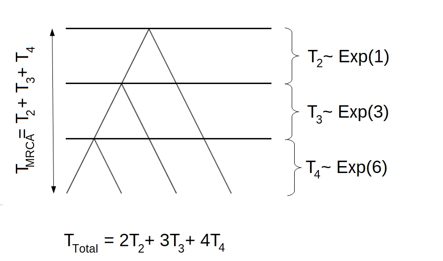
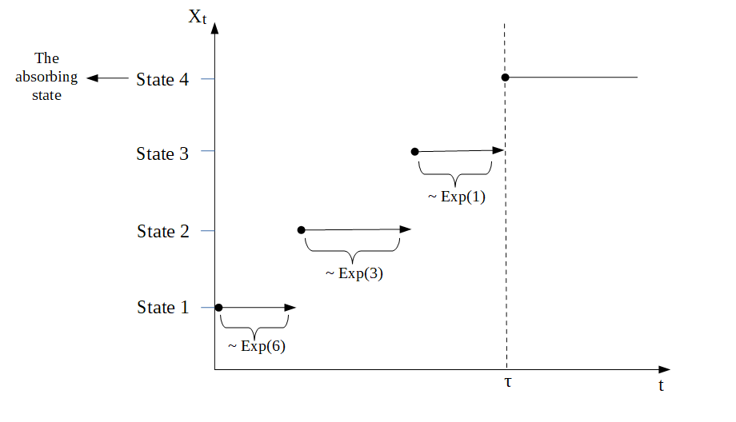
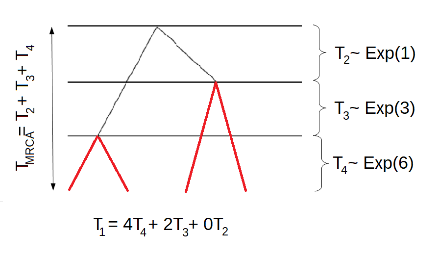
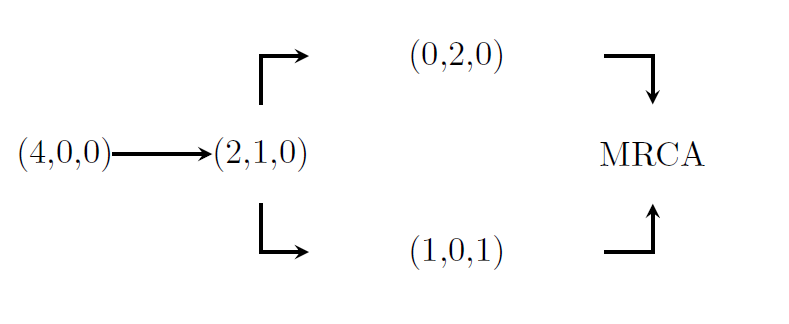

```{r, include = FALSE}
knitr::opts_chunk$set(
  collapse = TRUE,
  comment = "#>"
)
```

```{r setup, results='hide'}
library(PhaseTypeGenetics)
```
## Introduction to PhaseTypeGenetics
The aim of this package is to provide the user with some comprehensive tools to analyse discrete and continuous phase-type distributions. As recent research confirms the applicability of phase-type theory in population genetics, most of the examples provided in the package are based on coalescent theory. In addition, the package provides some function that are intended for the use in population genetics only.\

All functions and applications are based on the theory developed in 

* [BN] Mogens Bladt and Bo Friis Nielsen (2017): 
  \emph{ Matrix-Exponential Distributions in Applied Probability}. 
  Probability Theory and Stochastic Modelling (Springer), Volume 81 
* and [HSB] Asger Hobolth, Arno Siri-Jégousse, Mogens Bladt (2019): 
  \emph{Phase-type distributions in population genetics}. 
  Theoretical Population Biology, 127, pp. 16-32.

## Defining phase-type distributions

## Applications in Population Genetics

### Wright-Fisher model

We consider the Wright-Fisher model, i.e. generations are non-overlapping, the population size is fixed and each individual chose its parents uniformly at random. Let $N$ be the population size and $n$ the sample size. Furthermore, let $R_n$ be the number of generations until coalescent of any of the $n$ individuals. Then it holds that the time measured in number of generations $T_n = \tfrac{R_n}{n}$ is approximately exponentially distributed with a rate of $\binom{n}{2}$, 
\begin{equation*}
T_n \sim \text{ Exp}(\binom{n}{2}).
\end{equation*}
Due to this definition, the time to the most recent common ancestor is given as
\begin{equation*}
T_{\text{MRCA}} = T_2 + \cdots + T_n
\end{equation*}
and the total branch length can be defined in the following way
\begin{equation*}
T_{\text{Total}} = 2T_2 + \cdots + nT_n
\end{equation*}

#### Example 1:

For $n=4$, a possible tree could be\
```{r Tree, echo=FALSE, out.width = '70%'}

```

### The phase-type distribution

We can think of a tree as a continuous time Markov chain (CTMC) or a Markov jump process in the following way. We let State 1 correspond to $T_n$, State 2 denote $T_{n-1}$, etc. Then State $n-1$ corresponds to $T_2$ and State $n$ is the absorbing state, where all individuals have found the most recent common ancestor. In this scenario, $T_{MRCA}$ is the waiting time for the process to be absorbed in state $n$, 
\begin{equation*}
T_{\text{MRCA}} = \tau_{\text{MRCA}} = \inf\{t > 0 \mid X_t = \text{ State } n\}.
\end{equation*}
Due to the fact that $T_k \sim \text{ Exp}(\binom{k}{2})$, the corresponding rate matrix is defined as 
\begin{equation*}
\Lambda = \begin{pmatrix}
- \binom{n}{2} & \binom{n}{2} & 0 & 0 &\cdots & 0 \\
0 & -\binom{n-1}{2} & \binom{n-1}{2} & 0  & \cdots & 0 \\
\vdots & 0 & \ddots & \ddots & 0 & 0 \\
0 & \cdots & 0 & -3 & 3 & 0 \\
0 & \cdots & 0 & 0 & -1 & 1 \\
0 & \cdots & 0 & 0 & 0 & 0 \\
\end{pmatrix}
\end{equation*}
and as we are interested in the whole tree, the initial distribution is
\begin{equation*}
\pi = (1,0,…,0),
\end{equation*}
i.e. the process always starts in State 1.\
As all rows in a rate matrix have to sum to zero, and as we are interested in the time spend in the transient states, we can disregard the last state (the absorbing state). Instead, we consider the sub-intensity rate matrix T, which is the upper left sub-matrix of $\Lambda$
\begin{equation*}
\Lambda = \begin{pmatrix}
T & t \\
\mathbf{0} & 0
\end{pmatrix}
\end{equation*}
By letting $p$ denote the number of transient states, we have that $T$ is a $p \times p$ matrix, $t$ is a $p \times 1$ exit rate vector and $\mathbf{0}$ is a $1 \times p$ vector of zeros. 
As already mentioned, all rows in the generator matrix $\Lambda$ have to sum to zero, hence the exit rate vector can be computed as
\begin{equation*}
t = -T\boldsymbol{e},
\end{equation*}
where $\boldsymbol{e}$ is a $p \times 1$ vector with one in each entry. By disregarding the absorbing state, we also have to reduce the dimension of the initial distribution $\pi= (\pi_1,…,\pi_p)$. In this new set-up, $\pi$ is now a $1 \times p$ vector that has to sum to one.\
Now we have that the waiting time to absorption in state $p+1$, $\tau = \inf \{t > 0 \mid X_t =p+1\}$ is phase-type distributed with initial distribution $\pi$ and sub-intensity rate matrix $T$, and we write 
 \begin{equation*}
\tau \sim \text{PH}_p (\pi, T).
\end{equation*}

### Transformation via rewards
We can also define the total branch length as a phase-type distributed waiting time. In this situation, the initial distribution is the same, but the sub-intensity rate matrix $T$ looks different.  As
\begin{equation*}
T_k \sim \text{Exp}(\binom{k}{2}) = \text{Exp}(\tfrac{k(k-1)}{2}) 
\end{equation*}
and as  the exponential distribution is closed under scaling by a positive factor, 
\begin{equation*}
k T_k \sim  \text{Exp}(\tfrac{k(k-1)}{2k})=  \text{Exp}(\tfrac{(k-1)}{2}).
\end{equation*}
Hence, the sub-intensity rate matrix for the total branch length is
\begin{equation*}
T= \tfrac{1}{2} \begin{pmatrix}
- (n-1) & (n-1) & 0 & 0 &\cdots & 0 \\
0 & -(n-2) & (n-2) & 0  & \cdots & 0 \\
\vdots & 0 & \ddots & \ddots & 0 & 0 \\
0 & \cdots & 0 &  & -2 & 2 \\
0 & \cdots & 0 & 0 & 0 & -1 
\end{pmatrix}.
\end{equation*}
This is due to a concept called transformation via rewards. In general, we have that if $\tau \sim \text{PH}_p (\pi, T)$ with $\{X_t\}_{t\geq0}$ being the underlying Markov jump process and if $\mathbf{r}= (r(1),..., r(p))$ is a vector of non-negative reward rates, then the total reward $Y$ earned up to time $\tau$ is given as
\begin{equation*}
Y = \int_{0}^{\tau} r(X_t) dt.
\end{equation*}
This implies that if $r(i)\neq 0$ and $T_k\sim \text{Exp}(\tfrac{k(k-1)}{2})$ is a holding time in state $i$, then the reward earned during this holding time is simply 
\begin{equation*}
Y_k = r(k) T_k\sim \text{Exp}(\tfrac{k(k-1)}{2r(k)}).
\end{equation*}
As $\mathbf{r}= (n,n-1,..., 2)$ in connection to the total branch length, we get that 
\begin{equation*}
Y_k = k T_k\sim \text{Exp}(\tfrac{(k-1)}{2}),
\end{equation*}
which is exactly what we have seen above.\
If $r(i) \neq 0$ for all $i$ and $\Delta (\mathbf{r})$ denotes the diagonal matrix satisfying that $\Delta(\mathbf{r})_{ii} = r(i)$, then we have that
\begin{equation*}
Y \sim \text{PH}_p(\pi, \Delta^{-1} (\mathbf{r}) T),
\end{equation*}
which implies that the sub-intensity rate matrix for the total branch length is given as stated above.\

The transformation via positive rewards can be extended to the case where $r(i)$ is zero for some $i$'s. In this case, we call it transformation via non-negative rewards. This is important in connection to the site frequency spectrum.

#### Example 2:

As before, we consider $n=4$. In this situation, the Markov jump process would behave similar to the process displayed in the following graph\
```{r CTMC, echo=FALSE, out.width = '70%'}

```

The sub-intensity rate matrix corresponding to the time to the most recent common ancestor $T_{\text{MRCA}}$ would be 
\begin{equation*}
T_{\text{MRCA}}= \begin{pmatrix}
-6 & 6 & 0 \\
0 & -3& 3  \\
0 & 0  & -1\\
\end{pmatrix}
\end{equation*}
and the sub-intensity rate matrix corresponding to the total branch length $T_{\text{Total}}$ would be 
\begin{equation*}
T_{\text{Total}}= \tfrac{1}{2} \begin{pmatrix}
-3 & 3 & 0 \\
0 & -2& 2 \\
0 & 0  & -1\\
\end{pmatrix}.
\end{equation*}

### The total branch length

As before, we let $\{X_t\}_{t\geq0}$ be the underlying Markov jump process and we consider the time to the most recent common ancestor
$T_{\text{MRCA}} = \tau_{\text{MRCA}} \sim \text{PH}_p (\pi, T)$. 
But in this section, we use the block counting process to obtain the distribution of the waiting time $\tau_{\text{MRCA}}$.\
From the block counting process, we get a state space and a sub-intensity rate matrix. Each state of the state space is represented by a $n-1$ dimensional vector, such that the $i$'th entry corresponds to the number of branches giving rise to $i$'tons. That is, the first entry corresponds to the number of branches giving rise to singletons, the second entry corresponds to the number of double-tons, etc. 
Due to this set-up, the total length of all branches that have $i$ descendants in the sample can be obtained by the aid of the transformation via rewards,
\begin{equation*}
\tau_i = \int_{0}^{\tau_{\text{MRCA}}} r_i(X_t) dt,
\end{equation*}
where $r_i(j)$ is the number of $i$'tons in the $j$'th state for all $i,j \in \{1,...,n-1\}$.\
Then, $\tau_i$ is again phase type distributed with a new initial distribution, $\pi_i$, a new sub-intensity rate matrix, $T_i$, and defect size $\pi_{i,d+1}$, where $d$ is the number of positive rewards (and hence the new number of transient states).\

This approach can also be used to obtain the distribution of the total branch length. As before, the total branch length can be obtained by the aid of the transformation via rewards,
\begin{equation*}
\tau = \int_{0}^{\tau_{\text{MRCA}}} r(X_t) dt,
\end{equation*}
where $r(j)= r_1(j) + \cdots + r_{n-1}(j)$ is the sum of all $i$'tons in state $j$ for all $i,j \in \{1,...,n-1\}$.\

#### Example 3:

We continue the example with $n=4$. In this case, there are two possible trees. One of which is displayed above, the other is displayed in the following graph

```{r Tree2, echo=FALSE, out.width = '50%'}

```

The corresponding block counting process is given by

```{r BCP, echo=FALSE, out.width = '40%'}

```

and the sub-intensity rate matrix for this process is 
\begin{equation*}
T = \begin{pmatrix}
-6 & 6 & 0 & 0 \\
0 & -3 & 2 & 1 \\
0 & 0 & -1 & 0 \\
0 & 0 & 0 & -1 
\end{pmatrix}.
\end{equation*}
Hence, the waiting time to the most recent common ancestor
$T_{\text{MRCA}} = \tau_{\text{MRCA}}$ is now phase-type distributed with a different sub-intensity rate matrix.\
If we are interested in the total length of all branches giving rise to singletons, we have to give different rewards to the four states of the block counting process. Remember that the first tree had the following structure:

```{r T1, echo=FALSE, out.width = '40%'}
knitr::include_graphics("T1_n4.png")
```

Hence, the total length of all branches giving rise to singletons would be $T_1 = 4T_4 + 2T_3 + 1T_2$. For the other tree, the total length of branches having one descendant in the sample would be $T_1 = 4T_4 + 2T_3 + 0T_2$. Hence, $\mathbf{r}_1 = (4,2,1,0)$. By using the reward transformation, we get that the total length of branches giving rise to singletons is phase-type distributed with initial distribution $\pi_1 = (1,0,0)$ and sub-intensity rate matrix 
\begin{equation*}
T_1 = \begin{pmatrix}
-1.5 & 1.5 & 0 \\
0 & -1.5 & 1  \\
0 & 0 & -1  \\
\end{pmatrix}.
\end{equation*}
As one of the rewards is zero, we have a defect size of $\pi_{1,d+1}=0$, where $d=3$.\
We can also compute the total length of all branches $\tau$. 
For both the first and the second tree, the total branch length is given as $T = 4T_4 + 3T_3 + 2T_2$.Hence, the reward vector has to be $\mathbf{r} = (4,3,2,2)$. By using the reward transformation, we get that the total branch length is phase-type distributed with initial distribution $\pi = (1,0,0,0)$ and sub-intensity rate matrix 
\begin{equation*}
T = \begin{pmatrix}
-1.5 & 1.5 & 0 & 0\\
0 & -1 & 2/3 & 1/3\\
0 & 0 & -0.5 & 0\\
0 & 0 & 0 & -0.5\\
\end{pmatrix}.
\end{equation*}
This time, none of the rewards is zero. Hence, there is no defect size and the dimension of the new phase-type distribution is equal to the dimension of the original phase-type distribution.\

### The site frequencies

Now that we have found the distribution of the branch lengths, it is straight forward to compute the distribution of the site frequencies $\xi_i$ for all $i=1,...,n-1$ and the number of segregating sites $S_{\text{Total}}$.\
As before, we let $\tau_i$ denote the total length of all branches that have $i$ descendants in the sample and $\tau$ be the total length of all branches. Then, 
\begin{equation*}
\tau_i \sim \text{PH}(\pi_i, T_i) \quad \text{and} \quad \tau \sim \text{PH}(\pi, T).
\end{equation*}
Furthermore, we let $\lambda = \tfrac{\theta}{2}$ be the mutation rate at the locus. Then it holds that the number of segregating sites $S_{\text{Total}}$ conditionally on the total branch length $\tau$ is poisson distributed with rate $\tfrac{\theta}{2} \tau$, i.e.
\begin{equation*}
S_{\text{Total}} \mid \tau \sim \text{Pois}(\tfrac{\theta}{2} \tau).
\end{equation*}
Due to the law of total probability, it now holds that
\begin{align*}
P(S_{\text{Total}}=n) &= \int_{-\infty}^{\infty} P(S_{\text{Total}}=n \mid \tau = x) \cdot f_{\tau}(x) \quad dx\\
&= \int_{0}^{\infty} \frac{(\lambda x)^n}{n!} e^{-\lambda x} \cdot f_{\tau}(x) \quad dx\\
&= \frac{\lambda^n}{n!} \int_{0}^{\infty} x^n e^{-\lambda x} \cdot f_{\tau}(x) \quad dx
\end{align*}
for $n \geq 0$ and $x \geq 0$, where we have used that
\begin{equation*}
P(S_{\text{Total}}=n \mid \tau = x) = \frac{(\lambda x)^n}{n!} e^{-\lambda x}.
\end{equation*}
But the Laplace transform for $\tau$ is given as
\begin{equation*}
L_{\tau} (\lambda) = \mathbb{E}[e^{-\lambda \tau}] = \int_{0}^{\infty} e^{-\lambda x} \cdot f_{\tau}(x) \quad dx,
\end{equation*}
and as the differential of $L_{\tau} (\lambda)$ with respect to $\lambda$ is given by
\begin{align*}
\frac{\partial^n}{\partial \lambda ^n} L_{\tau} (\lambda) = \int_{0}^{\infty} (-1)^n x^n e^{-\lambda x} \cdot f_{\tau}(x) \quad dx,
\end{align*}
we have that
\begin{align*}
P(S_{\text{Total}}=n) &= \frac{\lambda^n}{n!} \int_{0}^{\infty} x^n e^{-\lambda x} \cdot f_{\tau}(x) \quad dx\\
&= \frac{\lambda^n}{n!} (-1)^n \frac{\partial^n}{\partial \lambda ^n} L_{\tau} (\lambda).
\end{align*}
On the other hand,
\begin{align*}
L_{\tau} (\lambda) &= \mathbb{E}[e^{-\lambda \tau}] = \int_{0}^{\infty} e^{-\lambda x} \cdot f_{\tau}(x) \quad dx\\
&= \int_{0}^{\infty} e^{-\lambda x} \cdot \pi e^{Tx}t \quad dx\\
&= \pi \int_{0}^{\infty} e^{-\lambda x} e^{Tx}\quad dx \, t \\
&= \pi \int_{0}^{\infty} e^{x(T -\lambda I)} \quad dx \, t \\
&= \pi \lim_{r \rightarrow \infty} \big[ (T -\lambda I)^{-1}e^{x(T -\lambda I)} \big]_{x=0}^{x=r}\, t\\
&= \pi \Big( \lim_{r \rightarrow \infty}  (T -\lambda I)^{-1}e^{r(T -\lambda I)}  -  (T -\lambda I)^{-1}e^{0 \cdot (T -\lambda I)}\Big) t\\
&= \pi \Big( 0 -  (T -\lambda I)^{-1}\Big) t\\
&= -  \pi(T -\lambda I)^{-1}t\\
&= \pi(\lambda I - T)^{-1}t
\end{align*}
where we have used that
\begin{equation*}
f_{\tau}(x) = \pi e^{Tx}t,
\end{equation*}
where $t=-Te$ is the exit rate vector and that
\begin{equation*}
\lim_{r \rightarrow \infty}  (T -\lambda I)^{-1}e^{r(T -\lambda I)} = 0,
\end{equation*}
as the eigenvalues of $(T -\lambda I)$ are negative.\
But this implies that 
\begin{align*}
\frac{\partial^n}{\partial \lambda ^n} L_{\tau} (\lambda) &=   \frac{\partial^n}{\partial \lambda ^n} \pi(\lambda I - T)^{-1}t\\
&= (-1)^{n} n! \pi(\lambda I - T)^{-n-1}t.
\end{align*}
We can insert this expression in the formula for $P(S_{\text{Total}}=n)$
\begin{align*}
P(S_{\text{Total}}=n) &= \frac{\lambda^n}{n!} (-1)^n \frac{\partial^n}{\partial \lambda ^n} L_{\tau} (\lambda)\\
&= \frac{\lambda^n}{n!} (-1)^n (-1)^{n} n! \pi(\lambda I - T)^{-n-1}t\\
&= \lambda^n\pi(\lambda I - T)^{-n-1}t\\
&= \lambda^n \pi \lambda^{-(n+1)} (I - \lambda^{-1}T)^{-n-1}t\\
&= \lambda^{-1} \pi (I - \lambda^{-1}T)^{-n-1}t.
\end{align*}
We can rewrite this expression in the following way
\begin{align*}
P(S_{\text{Total}}=n) &= \pi (I - \lambda^{-1}T)^{-n}  \lambda^{-1} (I - \lambda^{-1}T)^{-1}t\\
&= \pi P^n  p,
\end{align*}
where 
\begin{equation*}
P = (I - \lambda^{-1}T)^{-1}
\end{equation*}
and 
\begin{equation*}
p = \lambda^{-1} P t.
\end{equation*}
Then we have that 
\begin{align*}
p &= \lambda^{-1} P t = \lambda^{-1} (I - \lambda^{-1}T)^{-1} t\\
&= -\lambda^{-1} (I - \lambda^{-1}T)^{-1} Te\\
&= \boldsymbol{e} - \boldsymbol{e} -\lambda^{-1} (I - \lambda^{-1}T)^{-1} T\boldsymbol{e}\\
&= \boldsymbol{e} - ( I + \lambda^{-1} (I - \lambda^{-1}T)^{-1} T)\boldsymbol{e}\\
&= \boldsymbol{e} - (I - \lambda^{-1}T)^{-1}\boldsymbol{e}\\
&= \boldsymbol{e} - P\boldsymbol{e},
\end{align*}
where the second last identity is due to the Woodbury matrix identity which states that
\begin{align*}
(I - \lambda^{-1}T)^{-1} = I + \lambda^{-1} (I - \lambda^{-1}T)^{-1} T.
\end{align*}
Hence, 
\begin{align*}
P(S_{\text{Total}}=n) =  \pi P^n  p,
\end{align*}
where 
\begin{equation*}
P = (I - \lambda^{-1}T)^{-1} \quad \text{ and } \quad p=\boldsymbol{e}-P\boldsymbol{e}.
\end{equation*}
We recognize this density as the density of a discrete phase-type distribution with sub-transition probability matrix $P$ and exit probability vector $p$. As the discrete phase-type distributions is only defined for natural numbers excluding zero, we have to consider $S_{\text{Total}} +1$, i.e. 
\begin{equation*}
S_{\text{Total}} +1 \sim \text{ DPH}(\pi, P).
\end{equation*}

We can repeat the same computations for $\xi_i$ with $\tau$ replaced with $\tau_i$, $T$ replaced with $T_i$ and $\pi$ replaced with $\pi_i$ for all $i=1,...,n-1$ to see that
\begin{equation*}
\xi_i +1 \sim \text{ DPH}(\pi_i, P_i),
\end{equation*}
where 
\begin{equation*}
P_i = (I - \lambda^{-1}T_i)^{-1} \quad \text{ and } \quad p_i=\boldsymbol{e}-P_i \boldsymbol{e}.
\end{equation*}

#### Example 4:

For $n=4$, we have seen that the total length of branches giving rise to singletons is discrete phase-type distributed with initial distribution $\pi_i = (1,0,0)$, sub-intensity rate matrix 
\begin{equation*}
T_i = \begin{pmatrix}
-1.5 & 1.5 & 0 \\
0 & -1.5 & 1  \\
0 & 0 & -1  \\
\end{pmatrix}.
\end{equation*}
and defect size $\pi_{i,d+1}=0$, where $d=3$. From above we have that the number of singletons plus one is again phase-type distributed with initial distribution $\pi_i = (1,0,0)$ and sub-transition probability matrix 
\begin{equation*}
P_i = (I -\tfrac{2}{\theta} T_i)^{-1} = \begin{pmatrix}
0.4 & 0.24 & 0.12 \\
0 & 0.4 & 0.2  \\
0 & 0 & 0.5  \\
\end{pmatrix},
\end{equation*}
for $\theta = 2$. The defect size is still $\pi_{i,d+1}=0$.\
We can also compute the distribution of the number of segregating sites $S_{\text{Total}} +1$. From the previous example, we have that the total branch length $\tau$ is phase-type distributed with initial distribution $\pi = (1,0,0,0)$ and sub-intensity rate matrix 
\begin{equation*}
T = \begin{pmatrix}
-1.5 & 1.5 & 0 & 0\\
0 & -1 & 2/3 & 1/3\\
0 & 0 & -0.5 & 0\\
0 & 0 & 0 & -0.5\\
\end{pmatrix}.
\end{equation*}
Hence, the number of segregating sites plus one is also discrete phase-type distributed with initial distribution $\pi = (1,0,0,0)$ and sub-transition probability matrix 
\begin{equation*}
P = (I -\tfrac{2}{\theta} T)^{-1} = \begin{pmatrix}
0.4 & 0.3 & 4/30 & 2/30 \\
0 & 0.5 & 2/9 & 1/9 \\
0 & 0 & 2/3 & 0\\
0 & 0 & 0 & 2/3 \\
\end{pmatrix},
\end{equation*}
for $\theta = 2$. 

## The functions

***
\center __BlockCountProcess__ \center

***
h


***
\center __discphasetype & contphasetype__ \center

***
h

***
\center __discretization__ \center

***

h

***
\center __dphasetype, pphasetype, qphasetype & rphasetype__ \center

***
This package includes some functions that compute the basic properties of phase-type distributions, i.e. the density, distribution and quantile function as well as simulations.

### The density

#### - in the discrete case
In the following, let $\tau= \inf\{t\geq 1 \mid X_t = p+1\}$ be discrete phase-type distributed with initial distribution $\pi$ and sub-transition probability matrix $T$, $\tau \sim DPH_{p}(\pi,T)$.\
Then the density for $\tau$ is given by
\begin{align*}
\mathbb{P}(\tau= n) &= \sum_{i=1}^{p} \mathbb{P}(\tau=n \mid X_{n-1}=i)\mathbb{P}(X_{n-1}=i)\\
&= \sum_{i=1}^{p} \mathbb{P}(\tau=n \mid X_{n-1}=i) \sum_{j=1}^{p} \mathbb{P}(X_{n-1}=i \mid X_0 =j ) \mathbb{P}(X_0=j)\\
&= \sum_{i=1}^{p} \sum_{j=1}^{p} \mathbb{P}(\tau=n \mid X_{n-1}=i)  \mathbb{P}(X_{n-1}=i \mid X_0 =j ) \mathbb{P}(X_0=j)\\
\end{align*}
for $n \geq 1$, where the first and second equality are due to the law of total probability. Now we observe that the probability $\mathbb{P}(X_0=j)$ for the Markov jump process $(X_t)_{t\geq 0}$ to start in $j$ is equal to the $j$'th entry of the initial distribution. Furthermore, the probability $\mathbb{P}(\tau=n \mid X_{n-1}=i)$ for the process to be absorbed at time $n$, given that the process is in state $i$ at time $n-1$ is given by the $i$'th entry of the exit probability vector $t = \boldsymbol{e} - T \boldsymbol{e}$. Finally, the probability $\mathbb{P}(X_{n-1}=i \mid X_0 =j )$ for the process to be in state $i$ at time $n-1$ given that the process started in state $j$ (or equivalently the probability of going from state $j$ to state $i$ in time $n-1$) is given by the $(j,i)$'th element of sub-transition probability matrix $T^{n-1}$. Hence, we have that  
\begin{align*}
\mathbb{P}(\tau= n) &= \sum_{i=1}^{p} \sum_{j=1}^{p} \mathbb{P}(\tau=n \mid X_{n-1}=i)  \mathbb{P}(X_{n-1}=i \mid X_0 =j ) \mathbb{P}(X_0=j)\\
&= \sum_{i=1}^{p} \sum_{j=1}^{p} t_i (T^{n-1} )_{ji} \pi_j\\
&= \sum_{i=1}^{p} \sum_{j=1}^{p} \pi_j (T^{n-1} )_{ji} t_i\\
&= \pi T^{n-1} t.
\end{align*}

#### - in the continuous case
Now let $\tau= \inf\{t > 0 \mid X_t = p+1\}$ be continuous phase-type distributed with initial distribution $\pi$ and sub-intensity rate matrix $T$, $\tau \sim PH_{p}(\pi,T)$.\
Then the density for $\tau$ is given by the derivative of the distribution function (see next section)
\begin{align*}
f(u) &= \frac{\partial}{\partial u} F(u)\\
&= \frac{\partial}{\partial u} 1-\pi e^{Tu} \boldsymbol{e} \\
&= -\pi e^{Tu}T \boldsymbol{e}\\
&= \pi e^{Tu}t
\end{align*}
for $u \geq 0$, where we have used that $t = -T \boldsymbol{e}$.

### The distribution function

#### - in the discrete case
Let again $\tau= \inf\{t\geq 1 \mid X_t = p+1\}$ be discrete phase-type distributed with initial distribution $\pi$ and sub-transition probability matrix $T$, $\tau \sim DPH_{p}(\pi,T)$.\
Then the distribution function for $\tau$ is given by
\begin{align*}
F_{\tau}(n) = \mathbb{P}(\tau \leq n) &= 1- \mathbb{P}(\tau > n)\\
&= 1-\sum_{i=1}^{p} \mathbb{P}( X_{n}=i)\\
&= 1-\sum_{i=1}^{p} \sum_{j=1}^{p} \mathbb{P}( X_{n}=i \mid X_0 =j) \mathbb{P}( X_0 =j)
\end{align*}
for $n \geq 1$, where the fourth equality is due to the law of total probability. As before, we observe that the probability $\mathbb{P}(X_0=j)$ for the Markov jump process $(X_t)_{t\geq 0}$ to start in $j$ is equal to the $j$'th entry of the initial distribution, and that the probability $\mathbb{P}(X_{n}=i \mid X_0 =j )$ for the process to be in state $i$ at time $n$ given that the process started in state $j$ (or equivalently the probability of going from state $j$ to state $i$ in time $n$) is given by the $(j,i)$'th element of sub-transition probability matrix $T^{n}$. Hence, we have that  
\begin{align*}
F_{\tau}(n) &= 1-\sum_{i=1}^{p} \sum_{j=1}^{p} \mathbb{P}( X_{n}=i \mid X_0 =j) \mathbb{P}( X_0 =j)\\
&= 1-\sum_{i=1}^{p} \sum_{j=1}^{p} (T^{n})_{ji}\pi_j\\
&= 1-\sum_{i=1}^{p} \sum_{j=1}^{p} \pi_j(T^{n})_{ji}\\
&= 1- \pi T^{n}\boldsymbol{e}.
\end{align*}

#### - in the continuous case
As before, let $\tau= \inf\{t > 0 \mid X_t = p+1\}$ be continuous phase-type distributed with initial distribution $\pi$ and sub-intensity rate matrix $T$, $\tau \sim PH_{p}(\pi,T)$.\
Then the distribution function for $\tau$ is given by
\begin{align*}
 F_{\tau}(u) = \mathbb{P}(\tau \leq u) &= 1- \mathbb{P}(\tau > u)\\
&= 1-\sum_{i=1}^{p} \mathbb{P}( X_{u}=i)\\
&= 1-\sum_{i=1}^{p} \sum_{j=1}^{p} \mathbb{P}( X_{u}=i \mid X_0 =j) \mathbb{P}( X_0 =j)
\end{align*}
for $u \geq 0$, where the fourth equality is due to the law of total probability. As in the discrete case, we observe that the probability $\mathbb{P}(X_0=j)$ for the Markov jump process $(X_t)_{t\geq 0}$ to start in $j$ is equal to the $j$'th entry of the initial distribution, and that the probability $\mathbb{P}(X_{u}=i \mid X_0 =j )$ for the process to be in state $i$ at time $u$ given that the process started in state $j$ (or equivalently the probability of going from state $j$ to state $i$ in time $u$) is given by the $(j,i)$'th element of sub-transition probability matrix $e^{Tu}$. Hence, we have that  
\begin{align*}
F_{\tau}(n) &= 1-\sum_{i=1}^{p} \sum_{j=1}^{p} \mathbb{P}( X_{n}=i \mid X_0 =j) \mathbb{P}( X_0 =j)\\
&= 1-\sum_{i=1}^{p} \sum_{j=1}^{p} (e^{Tu})_{ji}\pi_j\\
&= 1-\sum_{i=1}^{p} \sum_{j=1}^{p} \pi_j(e^{Tu})_{ji}\\
&= 1- \pi e^{Tu}\boldsymbol{e}.
\end{align*}

### The quantile function

### Simulations

***
\center __dSegregatingSites__ \center

***

h

***
\center __maxima & minima__ \center

***

### Extremum of two independent discrete phase-type distributions
Consider $\tau_1\sim DPH_{p}(\alpha,S)$ and $\tau_2\sim DPH_{q}(\beta,T)$ independent. Then by Theorem 1.2.67 in [BN]
\begin{equation*}
\min(\tau_1,\tau_2)\sim DPH_{pq}(\alpha\otimes\beta,S\otimes T),
\end{equation*}
and
\begin{equation*}
\max(\tau_1,\tau_2)\sim DPH_{pq+p+q}(\begin{pmatrix}\alpha\otimes\beta & 0 & 0\end{pmatrix},K).
\end{equation*}
where
\begin{equation*}
K=\begin{pmatrix}S\otimes T & S\otimes t & s\otimes T\\
                  0 & S & 0\\
                  0 & 0 & T\end{pmatrix},
\end{equation*}
and $s=\boldsymbol{e}-S\boldsymbol{e}$, $t=\boldsymbol{e}-T\boldsymbol{e}$ are the vectors of exit-probabilities from $S$ and $T$ respectively.  
The proof is as follows. Let $\{X_1(n)\}_{n\in\mathbb{N}}$ denote the Markov chain underlying $\tau_1$. The transition probability matrix of this Markov chain is
\begin{equation*}
P_1=\begin{pmatrix}S & s\\ 0 & 1\end{pmatrix}.
\end{equation*}
Let $\{X_2(n)\}_{n\in\mathbb{N}}$ denote the Markov chain underlying $\tau_2$. The transition probability matrix of this Markov chain is
\begin{equation*}
P_2=\begin{pmatrix}T & t\\ 0 & 1\end{pmatrix}.
\end{equation*}
$\{Y(n)\}_{n\in\mathbb{N}}=\{(X_1(n),X_2(n))\}_{n\in\mathbb{N}}$ is a Markov Chain on the (lexicographically ordered) product space of the respective state spaces with transition probability matrix
\begin{equation*}
P_1\otimes P_2=\begin{pmatrix}S\otimes P_2 & s\otimes P_2 \\
                                0\otimes P_2 & 1\otimes P_2\end{pmatrix}
                =\begin{pmatrix}S\otimes T & S\otimes t & s\otimes T & s\otimes t\\
                                S\otimes 0 & S\otimes 1 & s\otimes 0 & s\otimes 1\\
                                0\otimes T & 0\otimes t & 1\otimes T & 1\otimes t\\
                                0\otimes 0 & 0\otimes 1 & 1\otimes 0 & 1\otimes 1
                \end{pmatrix}
                =\begin{pmatrix}S\otimes T & S\otimes t & s\otimes T & s\otimes t\\
                                0 & S & 0 & s\\
                                0 & 0 & T & t\\
                                0 & 0 & 0 & 1
                \end{pmatrix}.
\end{equation*}
We can write 
\begin{equation*}
\max(\tau_1,\tau_2)=\inf\{n\in\mathbb{N}:X_1(n)=p+1\text{ and } X_2(n)=q+1\}=\inf\{n\in\mathbb{N}:Y(n)=(p+1,q+1)\},
\end{equation*}
meaning that $\max(\tau_1,\tau_2)$ is exactly the stopping for absorption of $\{Y(n)\}_{n\in\mathbb{N}}$ which shows the subtransition matrix for $\max(\tau_1,\tau_2)$.
From $\{Y(n)\}_{n\in\mathbb{N}}$ we can make yet another Markov chain $\{Z(n)\}_{n\in\mathbb{N}}$ by setting
\begin{equation*}Z(n)=\begin{cases}Y(n),& \text{ if } X_1(n)\leq p \text{ and } X_2(n)\leq q,\\
                    (p+1,1),& \text{otherwise}\end{cases}.
\end{equation*}
Then $\{Z(n)\}_{n\in\mathbb{N}}$ is a Markov Chain with transition probability matrix
\begin{equation*}\begin{pmatrix}S\otimes T & r\\
                 0 & 1\end{pmatrix},\end{equation*}
where $r=e-(S\otimes T)e$. We can write 
\begin{equation*}\min(\tau_1,\tau_2)=\inf\{n\in\mathbb{N}:X_1(n)>p\text{ and } X_2(n)>q\}=\inf\{n\in\mathbb{N}:Z(n)=(p+1,1)\},
\end{equation*}meaning that $\min(\tau_1,\tau_2)$ is exactly the stopping for absorption of $\{Z(n)\}_{n\in\mathbb{N}}$ which shows the subtransition matrix for $\min(\tau_1,\tau_2)$.  
Initializing $\{Y(n)\}_{n\in\mathbb{N}}$ with $\begin{pmatrix}\alpha\otimes\beta & 0 & 0 & 0\end{pmatrix}$ and $\{Z(n)\}_{n\in\mathbb{N}}$ with $\begin{pmatrix}\alpha\otimes\beta & 0\end{pmatrix}$,
is precisely the way to initialize the underlying $\{X_1(n)\}_{n\in\mathbb{N}}$ and $\{X_2(n)\}_{n\in\mathbb{N}}$ with $\begin{pmatrix}\alpha & 0\end{pmatrix}$ and $\begin{pmatrix}\beta & 0\end{pmatrix}$ respectively.  
This theorem is implemented in the `minima`- and `maxima`-functions. They take two phase-type objects as input and if both of these are of the `discphasetype`-class, then they each output an object of the `discphasetype`-class with parameters calculated from the parameters of the given objects in accordance with the above theorem.

#### Example 5

Let's run the functions on pair of discrete phase-type distributions

```{r}
 tau1 <- discphasetype(initDist = c(.5,.2,.3),
                                P.mat = matrix(c(.1,.3,.2,.3,.2,.1,.2,.1,.3), 
                                               nrow = 3))
tau2 = discphasetype(initDist = c(.2,.7), 
                                  P.mat = matrix(c(.5,0,.3,.2), nrow = 2))
```
Plugging these into `minima` and `maxima` we get
```{r}
  minima(tau1,tau2)
  maxima(tau1,tau2) 
```

### Extremum of two independent continuous phase-type distributions
Consider $X\sim PH_{p}(\alpha,S)$ and $Y\sim PH_{q}(\beta,T)$ independent. Then by Corollary 3.1.32 in [BN]
\begin{equation*}
\min(X,Y)\sim PH_{pq}(\alpha\otimes\beta,S\oplus T),
\end{equation*}
and
\begin{equation*}
\max(X,Y)\sim PH_{pq+p+q}(\begin{pmatrix}\alpha\otimes\beta & 0 & 0\end{pmatrix},K).
\end{equation*}
where
\begin{equation*}K=\begin{pmatrix}S\oplus T & I\otimes t & s\otimes I\\
                  0 & S & 0\\
                  0 & 0 & T\end{pmatrix},
\end{equation*}
and $s=-S\boldsymbol{e}$ as well as $t=-T\boldsymbol{e}$ are the vectors of exit-rates from $S$ and $T$, respectively, and $\oplus$ is the Kronecker sum given by $A \oplus B =A\otimes I_{\text{dim}(B)} + I_{\text{dim}(A)}\otimes B$.\
The proof is as follows. Let $\{X_1(t)\}_{t\geq0}$ denote the Markov Jump Process underlying $X$. The rate matrix of this Markov Jump Process is
\begin{equation*}
Q_1=\begin{pmatrix}S & s\\ 0 & 0\end{pmatrix}.
\end{equation*}
Let $\{Y_1(t)\}_{t\geq0}$ denote the Markov Jump Process underlying $Y$. The rate matrix of this Markov Jump Process is
\begin{equation*}
Q_2=\begin{pmatrix}T & t\\ 0 & 0\end{pmatrix}.
\end{equation*}
$\{Z(t)\}_{t\geq0}=\{(X_1(t),Y_1(t))\}_{t\geq0}$ is a Markov Jump Process on the (lexicographically ordered) product space of the respective state spaces with rate matrix
\begin{equation*}Q_1\oplus Q_2=\begin{pmatrix}S\oplus T & I\otimes t & s\otimes I & 0\\
                                0 & S & 0 & s\\
                                0 & 0 & T & t\\
                                0 & 0 & 0 & 0
                \end{pmatrix}.
\end{equation*}
We can write 
\begin{equation*}\max(X,Y)=\inf\{t\geq0\in\mathbb{N}:X_1(t)=p+1\text{ and } Y_1(t)=q+1\}=\inf\{t\geq0:Z(t)=(p+1,q+1)\},
\end{equation*}
meaning that $\max(X,Y)$ is exactly the stopping time for absorption of $\{Z(t)\}_{t\geq0}$ which shows the subintensity matrix for $\max(X,Y)$.
From $\{Z(t)\}_{t\geq0}=\{(X_1(t),Y_1(t))\}_{t\geq0}$ we can make yet another Markov Jump Process $\{W(t)\}_{t\geq0}$ by setting
\begin{equation*W(t)=\begin{cases}Y(t),& \text{ if } X_1(t)\leq p \text{ and } Y_1(t)\leq q,\\
                    (p+1,1),& \text{otherwise}\end{cases}.
\end{equation*}
Then $\{W(t)\}_{t\geq0}$ is a Markov Jump Process with rate matrix
\begin{equation*\begin{pmatrix}S\oplus T & r\\
                 0 & 1\end{pmatrix},
\end{equation*}
where $r=e-(S\oplus T)e$. We can write 
\begin{equation*}\min(X,Y)=\inf\{t\geq0:X_1(t)>p\text{ and } Y_1(t)>q\}=\inf\{t\geq0:W(t)=(p+1,1)\},
\end{equation*} 
meaning that $\min(X,Y)$ is exactly the stopping time for absorption of $\{W(t)\}_{t\geq0}$ which shows the subintensity matrix for $\min(X,Y)$.  
Initializing $\{Z(t)\}_{t\geq0}$ with $\begin{pmatrix}\alpha\otimes\beta & 0 & 0 & 0\end{pmatrix}$ and $\{W(t)\}_{t\geq0}$ with $\begin{pmatrix}\alpha\otimes\beta & 0\end{pmatrix}$,
is precisely the way to initialize the underlying $\{X_1(t)\}_{t\geq0}$ and $\{Y_1(t)\}_{t\geq0}$ with $\begin{pmatrix}\alpha & 0\end{pmatrix}$ and $\begin{pmatrix}\beta & 0\end{pmatrix}$ respectively.   
This result is implemented in the `phasemin` and `phasemax` functions. They take two phase-type objects as input and if both of these are of the `contphasetype`class, then they each output an object of the `contphasetype`class with parameters calculated from the parameters of the given objects in accordance with the above theorem. 

#### Example 6

Let's run the functions on pair of continuous phase-type distributions

```{r}
x_1 <- contphasetype(initDist = c(.12,.53,.24),
                                 T.mat = matrix(c(-6,1,1,2,-8,0,2,3,-5), nrow = 3))
x_2 <- contphasetype(initDist = c(.7,.3),
                                T.mat = matrix(c(-2,1,2,-4), nrow = 2))
```
Plugging these into `minima` and `maxima` we get
```{r}
  minima(x_1,x_2)
  maxima(x_1,x_2)
```

***
\center __mean & var__ \center

***
h


***
\center __moments__ \center

***

h


***
\center __phsum__ \center

***

### Sums of independent discrete phase-type distributions

Consider $\tau_1\sim DPH_{p}(\alpha,S)$ and $\tau_2\sim DPH_{q}(\beta,T)$ independent. Then by Theorem 1.2.65 in [BN]

\begin{equation*}
\tau_1+\tau_2\sim DPH_{p+q}\bigg(\begin{pmatrix}\alpha & \boldsymbol{0}\end{pmatrix},\begin{pmatrix}S & s\beta \\ \boldsymbol{0} & T\end{pmatrix}\bigg),
\end{equation*}
where $s=\boldsymbol{e}-S\boldsymbol{e}$ is the vector of exit-probabilities from $S$.\

The proof of this is that we take the two underlying Markov Chains and knit them together to form a new Markov Chain that first has to behave as the Markov Chain corresponding to $\tau_1$ until it is absorbed and from then on behave as the Markov Chain corresponding to $\tau_2$. The waiting time for absorption in this new Markov Chain then has the same distribution as $\tau_1+\tau_2$.  
Formally the way we make this new Markov Chain is that the state space is $\{1,\dotsc,p+q+1\}$ and we make the states $\{1,\dotsc,p\}$ correspond to the $p$ transient states in the Markov Chain underlying $\tau_1$ and the states $\{p+1,\dotsc,p+q\}$ correspond to the $q$ transient states in the Markov Chain underlying $\tau_2$.  
The initial distribution for the sum is $\begin{pmatrix}\alpha & \boldsymbol{0}\end{pmatrix}$ because then we will initialize in one of the states $\{1,\dotsc,p\}$ and the probability is that of the transient states for $\tau_1$.\  
The probabilities for transition among the states $\{1,\dotsc,p\}$ is given by $S$. In the new Markov Chain we combine the absorption of the first Markov Chain with in the initialization of the second Markov Chain. This is why the upper right corner of the the new sub-transition matrix is given $s\beta$. This matrix has dimension $p\times q$ and for $i\in\{1,\dotsc,p\}$ and $j\in\{1,\dotsc,q\}$ the $(i,j)$'th entry is $s_i\beta_j$, which is the probability of exiting the first Markov Chain from state $i$ and entering the second Markov chain in state its $j$'th state. The probabilities for transition among the states $\{p+1,\dotsc,p+q\}$ are the same as transition amond the $q$ transient states underlying $\tau_2$, and is given by $T$.  
This theorem is implemented in the `phsum`-function. It takes two phase-type objects as input and if both of these are of the `discphasetype`-class, then it outputs an object of the `discphasetype`-class with parameters calculated from the parameters of the given objects in accordance with the above theorem.

#### Example 7

Suppose that 
\begin{equation*}
\tau_1\sim DPH_{2}(\begin{pmatrix}0.5 & 0.5\end{pmatrix},\begin{pmatrix}0.4 & 0.2 \\ 0.9 & 0\end{pmatrix})
\end{equation*}
and
\begin{equation*}
\tau_2\sim DPH_{2}(\begin{pmatrix}0.75 & 0.2\end{pmatrix},\begin{pmatrix}0.1 & 0.7 \\ 0.2 & 0.7\end{pmatrix})
\end{equation*}
then 
\begin{equation*}
\begin{pmatrix}0.1 \\ 0.1\end{pmatrix}\begin{pmatrix}0.75 & 0.2\end{pmatrix}=\begin{pmatrix}0.075 & 0.02\\ 0.075 & 0.02\end{pmatrix}
\end{equation*}
so
$\tau_1+\tau_2$ follows a discrete phase-type distribution with initial distribution
\begin{equation*}
\begin{pmatrix} 0.5 & 0.5 & 0 & 0\end{pmatrix}
\end{equation*}
and subtransition probability matrix
\begin{equation*}
\begin{pmatrix}0.4 & 0.2 & 0.075 & 0.02\\
               0.9 & 0 & 0.075 & 0.02\\
               0 & 0 & 0.1 & 0.7 \\
               0 & 0 & 0.2 & 0.7\end{pmatrix}
\end{equation*}

### Sums of independent continuous phase-type distributions

Consider $X\sim PH_{p}(\alpha,S)$ and $Y\sim PH_{q}(\beta,T)$ independent. Then by Theorem 3.1.26 in [BN]
\begin{equation*}
X+Y\sim PH_{p+q}\bigg(\begin{pmatrix}\alpha & \boldsymbol{0}\end{pmatrix},\begin{pmatrix}S & s\beta \\ \boldsymbol{0} & T\end{pmatrix}\bigg),
\end{equation*}
where $s=-S\boldsymbol{e}$ is the vector of exit-rates from $S$.  
Similarly to the discrete case the proof of this is constructing a Markov Jump Process behaves as the Markov Jump Process underlying $X$ until it is absorbed and from then on behaves as the Markov Jump Process underlying $Y$.  
Similar consideration as in the discrete case show that one way of making such a Markov Jump Process is with initial distribution and subintensity matrix as stated in the theorem.
This theorem is implemented in the `phsum`-function. It takes two phase-type objects as input and if both of these are of the `contphasetype`-class, then it outputs an object of the `contphasetype`-class with parameters calculated from the parameters of the given objects in accordance with the above theorem.

#### Example 8

Suppose a random variable $E$ follows an exponential distribution with parameter $\lambda>0$. Then by comparing the distribution functions we see that that $E\sim PH_{1}(1,-\lambda)$. It now follows that if $E_1,\dotsc,E_n$ are independent exponentially distributed random variables with respective parameters $\lambda_1,\dotsc,\lambda_n$ then

\begin{equation*}
\sum_{i=1}^{n}E_i\sim PH_{n}(\begin{pmatrix}1 & 0 & \cdots & 0\end{pmatrix},\Lambda_n),
\end{equation*}
where the $(i,j)$'th entry of $\Lambda_n$ is given by
\begin{equation*}
(\Lambda_n)_{i,j}=
\begin{cases}   \lambda_i, &\text{ if }j=i+1,\\
               -\lambda_i, &\text{ if }j=i,\\
                 0, & \text{ otherwise.}
\end{cases}
\end{equation*}

***
\center __RewTransDistribution__ \center

***

### Discretization of a continuous phase-type distribution

In the `PhaseTypeGenetics` package we have implemented two ways of transforming a subintensity matrix into a subtransition probability matrix. These we have implemented in the `dicretization` function.  

#### The first transformation

Let $T$ be a subintensity matrix, then for any $a$ greater than the maximum of the absolute value of the diagonal entries of $T$, 
\begin{equation*}
I+a^{-1}T
\end{equation*}
is a subtransition probability matrix. The function is implemented so that `discretization` applied to a `contphasetype` object with initial distribution $\alpha$ and subintensity matrix $T$ and a given $a$ returns a `discphasetype`object with initial distribution $\alpha$ and subtransition probability matrix $I+a^{-1}T$.

#### The second transformation

The basis of this transformation is found in [HSB]. Let $X\sim PH(\alpha,T)$. Then for a $\lambda>0$ and a random variable $Y$ satisfying that 
\begin{equation*}Y|X\sim\text{Poisson}(\lambda X),
\end{equation*}
is can be shown that
\begin{equation*}Y+1\sim DPH(\alpha,(I-\lambda^{-1}T)^{-1}).
\end{equation*}
The function is implemented so that `discretization` applied to a `contphasetype` object with initial distribution $\alpha$ and subintensity matrix $T$ and a given $\lambda$ returns a `discphasetype`object with initial distribution $\alpha$ and subtransition probability matrix $(I-\lambda^{-1}T)^{-1})$.

#### Using the function

The function takes three parameters: `object`, `a` and `lambda`.  
`object` must be of the class `contphasetype` and `a` and `lambda` mus be numbers greater than 0. `a` and `lambda` are both `NULL` as default. You must give either an `a` parameter or a `lambda` parameter.  
If the given `a` is greater than the maximum of the absolute value of the diagonal entries of the subintensity matrix of `object`, `discretization(object = object,a = a)` performs the first transformation of the object.
If `lambda` is given then `discretization(object = object,lambda = lambda)` performs the second transformation of the object.  
It is also possible to give both an `a` and a `lambda`. `discretization(object = object, a = a,lambda = lambda)`, returns a list where the first entry is the first transformation of `object` with `a` and the second entry is the second transformation of `object` with `lambda`.

##### Example 9

```{r}
(x_1 <-  contphasetype(initDist = c(.5,.2,.3,0),
                                 T.mat = matrix(c(-6,1,1,0,2,-8,0,0,2,3,-5,0,0,3,2,-4), nrow = 4)))
discretization(x_1, a = 12, lambda = 2)

```

### Transformation via rewards

Starting from a continuous phase-type distributed random variable $\tau\sim PH_p(\alpha,T)$, we can do what is called a reward-transformation of the underlying Markov Jump Process $\{X_t\}_{t\geq0}$. Formally we let $r=(r(1),\dotsc,r(p))$ be a vector of non-negative numbers(the reward vector) and write
\begin{equation*}
Y=\int_{0}^{\tau}r(X_t)\text{d}t.
\end{equation*}
Mogens Bladt and Bo Friis Nielsen([BN] Theorem 3.1.33) prove that the random variable $Y$ follows a continuous phase-type distribution.  
$Y$ should be interpreted as
\begin{equation*}Y=\sum_{i=1}^{p}r(i)Z_i,
\end{equation*}
$Z_i$ is the total time spent in state $i$ prior to absorption. If $r(i)>0$ for all $i$ then
\begin{equation*}Y\sim PH_p(\alpha,\Delta(r)^{-1}T).
\end{equation*}
Because the holding time in state $i$ is exponentially distributed with parameter $-t_{i,i}$. Handling a case where $r(i)=0$ for some $i$ is a lot more tricky.  
Basically we want to find the rate matrix for the Markov Jump Process that arises when we take $\{X_t\}_{t\geq0}$ and delete any transitions into a state for which the reward is $0$, and subsequently delete any possible self-transitions. Afterwards we transform this Markov Jump Process as before, because the remaining states $i$ all satisfy $r(i)>0$.  
Before the deletion the probability of $\{X_t\}_{t\geq0}$ transitioning from a one transient state $i$ to another transient state $j$ is $-\frac{t_{i,j}}{t_{i,i}}$. Let's say that $r(i)>0$ and $r(j)>0$. After the "deletion" of the $0$-reward states there are many ways of transitioning from $i$ to $j$. Leaving $i$, $\{X_t\}_{t\geq0}$ could transition to a $0$-reward transient state and from there make finitely many jumps among $0$-reward transient states before jumping to $j$, but in the "deletion" process this would only register as a jump from $i$ to $j$.  
The transformation also impacts the initial distribution, because initializing in a $0$-reward transient state will be ignored, but $\{X_t\}_{t\geq0}$ could be absorbed directly from a $0$-reward state before visiting a state with a strictly positive reward. There the entries of the initial distribution for $Y$ do not necessarily add up to $1$.

#### The function

In the `PhaseTypeGenetics` we have implemented the function `RewTransDistribution`. It takes two parameters `object` and `rewards`. `object` is the `contphasetype` basis for the transformation ($\tau$ in the above), and `rewards` is the vector of rewards to transform `object` by($r$ in the above.) The function returns a `contphasetype` object with the parameters obtained from Theorem 3.1.33 in [BN].

##### Example 10

```{r}

(x_2 <-  contphasetype(initDist = c(.2,.7), 
                                T.mat = matrix(c(-7,3,2,-4), nrow = 2)))

RewTransDistribution(x_2,c(2,3))
x_1
RewTransDistribution(x_1,c(0,2,1,0))

```

***
\center __SiteFrequencies__ \center

***
h

***
\center __summary__ \center

***
h

