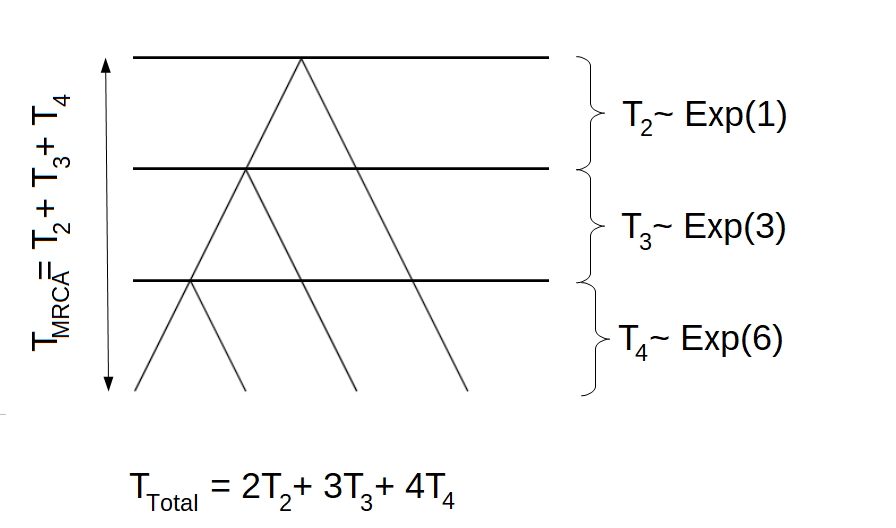
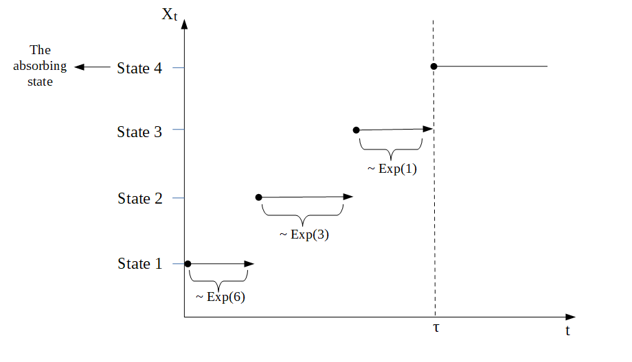
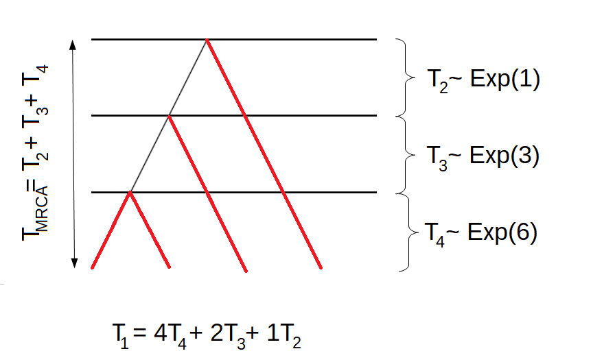

```{r setup, include=FALSE}
knitr::opts_chunk$set(echo = TRUE)
```

## Applications in Population Genetics

### Wright-Fisher model

We consider the Wright-Fisher model, i.e. generations are non-overlapping, the population size is fixed and each individual chose its parents uniformly at random. Let $N$ be the population size and $n$ the sample size. Furthermore, let $R_n$ be the number of generations until coalescent of any of the $n$ individuals. Then it holds that the time measured in number of generations $T_n = \tfrac{R_n}{n}$ is approximately exponentially distributed with a rate of $\binom{n}{2}$, 
\begin{equation*}
T_n \sim \text{ Exp}(\binom{n}{2}).
\end{equation*}
Due to this definition, the time to the most recent common ancestor is given as
\begin{equation*}
T_{\text{MRCA}} = T_2 + \cdots + T_n
\end{equation*}
and the total branch length can be defined in the following way
\begin{equation*}
T_{\text{Total}} = 2T_2 + \cdots + nT_n
\end{equation*}

#### Example 1:

For $n=4$, a possible tree could be\
```{r Tree, echo=FALSE, out.width = '70%'}

```

### The phase-type distribution

We can think of a tree as a continuous time Markov chain (CTMC) or a Markov jump process in the following way. We let State 1 correspond to $T_n$, State 2 denote $T_{n-1}$, etc. Then State $n-1$ corresponds to $T_2$ and State $n$ is the absorbing state, where all individuals have found the most recent common ancestor. In this scenario, $T_{MRCA}$ is the waiting time for the process to be absorbed in state $n$, 
\begin{equation*}
T_{\text{MRCA}} = \tau_{\text{MRCA}} = \inf\{t > 0 \mid X_t = \text{ State } n\}.
\end{equation*}
Due to the fact that $T_k \sim \text{ Exp}(\binom{k}{2})$, the corresponding rate matrix is defined as 
\begin{equation*}
\Lambda = \begin{pmatrix}
- \binom{n}{2} & \binom{n}{2} & 0 & 0 &\cdots & 0 \\
0 & -\binom{n-1}{2} & \binom{n-1}{2} & 0  & \cdots & 0 \\
\vdots & 0 & \ddots & \ddots & 0 & 0 \\
0 & \cdots & 0 & -3 & 3 & 0 \\
0 & \cdots & 0 & 0 & -1 & 1 \\
0 & \cdots & 0 & 0 & 0 & 0 \\
\end{pmatrix}
\end{equation*}
and as we are interested in the whole tree, the initial distribution is
\begin{equation*}
\pi = (1,0,…,0),
\end{equation*}
i.e. the process always starts in State 1.\
As all rows in a rate matrix have to sum to zero, and as we are interested in the time spend in the transient states, we can disregard the last state (the absorbing state). Instead, we consider the subintensity rate matrix T, which is the upper left sub-matrix of $\Lambda$
\begin{equation*}
\Lambda = \begin{pmatrix}
T & t \\
\mathbf{0} & 0
\end{pmatrix}
\end{equation*}
By letting $p$ denote the number of transient states, we have that $T$ is a $p \times p$ matrix, $t$ is a $p \times 1$ exit rate vector and $\mathbf{0}$ is a $1 \times p$ vector of zeros. 
As already mentioned, all rows in the generator matrix $\Lambda$ have to sum to zero, hence the exit rate vector can be computed as
\begin{equation*}
t = -Te,
\end{equation*}
where $e$ is a $p \times 1$ vector with one in each entry. By disregarding the absorbing state, we also have to reduce the dimension of the initial distribution $\pi= (\pi_1,…,\pi_p)$. In this new setup, $\pi$ is now a $1 \times p$ vector that has to sum to one.\
Now we have that the waiting time to absorption in state $p+1$, $\tau = \inf \{t > 0 \mid X_t =p+1\}$ is phase-type distributed with initial distribution $\pi$ and subintensity rate matrix $T$, and we write 
 \begin{equation*}
\tau \sim \text{PH}_p (\pi, T).
\end{equation*}

### Transformation via rewards
We can also define the total branch length as a phase-type distributed waiting time. In this situation, the initial distribution is the same, but the subintensity rate matrix $T$ looks different.  As
\begin{equation*}
T_k \sim \text{Exp}(\binom{k}{2}) = \text{Exp}(\tfrac{k(k-1)}{2}) 
\end{equation*}
and as  the exponential distribution is closed under scaling by a positive factor, 
\begin{equation*}
k T_k \sim  \text{Exp}(\tfrac{k(k-1)}{2k})=  \text{Exp}(\tfrac{(k-1)}{2}).
\end{equation*}
Hence, the subintensity rate matrix for the total branch length is
\begin{equation*}
T= \tfrac{1}{2} \begin{pmatrix}
- (n-1) & (n-1) & 0 & 0 &\cdots & 0 \\
0 & -(n-2) & (n-2) & 0  & \cdots & 0 \\
\vdots & 0 & \ddots & \ddots & 0 & 0 \\
0 & \cdots & 0 &  & -2 & 2 \\
0 & \cdots & 0 & 0 & 0 & -1 
\end{pmatrix}.
\end{equation*}
This is due to a concept called transformation via rewards. In general, we have that if $\tau \sim \text{PH}_p (\pi, T)$ with $\{X_t\}_{t\geq0}$ being the underlying Markov jump process and if $\mathbf{r}= (r(1),..., r(p))$ is a vector of non-negative reward rates, then the total reward $Y$ earned up to time $\tau$ is given as
\begin{equation*}
Y = \int_{0}^{\tau} r(X_t) dt.
\end{equation*}
This implies that if $r(i)\neq 0$ and $T_k\sim \text{Exp}(\tfrac{k(k-1)}{2})$ is a holding time in state $i$, then the reward earned during this holding time is simply 
\begin{equation*}
Y_k = r(k) T_k\sim \text{Exp}(\tfrac{k(k-1)}{2r(k)}).
\end{equation*}
As $\mathbf{r}= (n,n-1,..., 2)$ in connection to the total branch length, we get that 
\begin{equation*}
Y_k = k T_k\sim \text{Exp}(\tfrac{(k-1)}{2}),
\end{equation*}
which is exactly what we have seen above.\
If $r(i) \neq 0$ for all $i$ and $\Delta (\mathbf{r})$ denotes the diagonal matrix satisfying that $\Delta(\mathbf{r})_{ii} = r(i)$, then we have that
\begin{equation*}
Y \sim \text{PH}_p(\pi, \Delta^{-1} (\mathbf{r}) T),
\end{equation*}
which implies that the subintensity rate matrix for the total branch length is given as stated above.\

The transformation via positive rewards can be extended to the case where $r(i)$ is zero for some $i$'s. In this case, we call it transformation via non-negative rewards. This is important in connection to the site frequency spectrum.

#### Example 2:

As before, we consider $n=4$. In this situation, the Markov jump process would behave similar to the process displayed in the following graph\
```{r CTMC, echo=FALSE, out.width = '70%'}

```

The subintensity rate matrix corresponding to the time to the most recent common ancestor $T_{\text{MRCA}}$ would be 
\begin{equation*}
T_{\text{MRCA}}= \begin{pmatrix}
-6 & 6 & 0 \\
0 & -3& 3  \\
0 & 0  & -1\\
\end{pmatrix}
\end{equation*}
and the subintensity rate matrix corresponding to the total branch length $T_{\text{Total}}$ would be 
\begin{equation*}
T_{\text{Total}}= \tfrac{1}{2} \begin{pmatrix}
-3 & 3 & 0 \\
0 & -2& 2 \\
0 & 0  & -1\\
\end{pmatrix}.
\end{equation*}

### The total branch length

As before, we let $\{X_t\}_{t\geq0}$ be the underlying Markov jump process and we consider the time to the most recent common ancestor
$T_{\text{MRCA}} = \tau_{\text{MRCA}} \sim \text{PH}_p (\pi, T)$. 
But in this section, we use the block counting process to obtain the distribution of the waiting time $\tau_{\text{MRCA}}$.\
From the block counting process, we get a state space and a subintensity rate matrix. Each state of the state space is represented by a $n-1$ dimensional vector, such that the $i$'th entry correpsonds to the number of branches giving rise to $i$'tons. That is, the first entry corresponds to the number of branches giving rise to singletons, the second entry corresponds to the number of doubletons, etc. 
Due to this setup, the total length of all branches that have $i$ descendents in the sample can be obtained by the aid of the transformation via rewards,
\begin{equation*}
\tau_i = \int_{0}^{\tau_{\text{MRCA}}} r_i(X_t) dt,
\end{equation*}
where $r_i(j)$ is the number of $i$'tons in the $j$th state for all $i,j \in \{1,...,n-1\}$.\
Then, $\tau_i$ is again phase type distributed with a new initial distribution, $\pi_i$, a new subintensity rate matrix, $T_i$, and defect size $\pi_{i,d+1}$, where $d$ is the number of positive rewards (and hence the new number of transient states).\

This approach can also be used to obatin the distribution of the total branch length. As before, the total branch length can be obtained by the aid of the transformation via rewards,
\begin{equation*}
\tau = \int_{0}^{\tau_{\text{MRCA}}} r(X_t) dt,
\end{equation*}
where $r(j)= r_1(j) + \cdots + r_{n-1}(j)$ is the sum of all $i$'tons in state $j$ for all $i,j \in \{1,...,n-1\}$.\

#### Example 3:

We continue the example with $n=4$. In this case, there are two possible trees. One of which is disblayed above, the other is displayed in the following graph

```{r Tree2, echo=FALSE, out.width = '50%'}
knitr::include_graphics("Tree2_n4.png")
```

The corresponding block counting process is given by

```{r BCP, echo=FALSE, out.width = '40%'}
knitr::include_graphics("BCP.png")
```

and the subintesity rate matrix for this proces is 
\begin{equation*}
T = \begin{pmatrix}
-6 & 6 & 0 & 0 \\
0 & -3 & 2 & 1 \\
0 & 0 & -1 & 0 \\
0 & 0 & 0 & -1 
\end{pmatrix}.
\end{equation*}
Hence, the waiting time to the most recent common ancestor
$T_{\text{MRCA}} = \tau_{\text{MRCA}}$ is now phase-type distributed with a different subintensity rate matrix.\
If we are interesed in the total length of all branches giving rise to singletons, we have to give different rewards to the four states of the block counting process. Remember that the first tree had the following structure:

```{r T1, echo=FALSE, out.width = '40%'}

```

Hence, the total length of all branches giving rise to singletons would be $T_1 = 4T_4 + 2T_3 + 1T_2$. For the other tree, the total length of branches having one descendant in the sample would be $T_1 = 4T_4 + 2T_3 + 0T_2$. Hence, $\mathbf{r}_1 = (4,2,1,0)$. By using the reward transformation, we get that the total length of branches giving rise to singletons is phase-type distributed with initial distribution $\pi_1 = (1,0,0)$ and subintensity rate matrix 
\begin{equation*}
T_1 = \begin{pmatrix}
-1.5 & 1.5 & 0 \\
0 & -1.5 & 1  \\
0 & 0 & -1  \\
\end{pmatrix}.
\end{equation*}
As one of the rewards is zero, we have a defect size of $\pi_{1,d+1}=0$, where $d=3$.\
We can also compute the total length of all branches $\tau$. 
For both the first and the second tree, the total branch length is given as $T = 4T_4 + 3T_3 + 2T_2$.Hence, the reward vector has to be $\mathbf{r} = (4,3,2,2)$. By using the reward transformation, we get that the total branch length is phase-type distributed with initial distribution $\pi = (1,0,0,0)$ and subintensity rate matrix 
\begin{equation*}
T = \begin{pmatrix}
-1.5 & 1.5 & 0 & 0\\
0 & -1 & 2/3 & 1/3\\
0 & 0 & -0.5 & 0\\
0 & 0 & 0 & -0.5\\
\end{pmatrix}.
\end{equation*}
This time, none of the rewards is zero. Hence, there is no defect size and the dimension of the new phase-type distribution is equal to the dimension of the original phase-type distribution.\

### The site frequencies

Now that we have found the distribution of the branch lengths, it is straight forward to compute the distribution of the site frequencies $\xi_i$ for all $i=1,...,n-1$ and the number of segregating sites $S_{\text{Total}}$.\
As before, we let $\tau_i$ denote the total length of all branches that have $i$ descendents in the sample and $\tau$ be the total length of all branches. Then, 
\begin{equation*}
\tau_i \sim \text{PH}(\pi_i, T_i) \quad \text{and} \quad \tau \sim \text{PH}(\pi, T).
\end{equation*}
Furthermore, we let $\lambda = \tfrac{\theta}{2}$ be the mutation rate at the locus. Then it holds that the number of segregating sites $S_{\text{Total}}$ conditionally on the total branch length $\tau$ is poisson distributed with rate $\tfrac{\theta}{2} \tau$, i.e.
\begin{equation*}
S_{\text{Total}} \mid \tau \sim \text{Pois}(\tfrac{\theta}{2} \tau).
\end{equation*}
Due to the law of total probability, it now holds that
\begin{align*}
P(S_{\text{Total}}=n) &= \int_{-\infty}^{\infty} P(S_{\text{Total}}=n \mid \tau = x) \cdot f_{\tau}(x) \quad dx\\
&= \int_{0}^{\infty} \frac{(\lambda x)^n}{n!} e^{-\lambda x} \cdot f_{\tau}(x) \quad dx\\
&= \frac{\lambda^n}{n!} \int_{0}^{\infty} x^n e^{-\lambda x} \cdot f_{\tau}(x) \quad dx
\end{align*}
for $n \geq 0$ and $x \geq 0$, where we have used that
\begin{equation*}
P(S_{\text{Total}}=n \mid \tau = x) = \frac{(\lambda x)^n}{n!} e^{-\lambda x}.
\end{equation*}
But the Laplace transform for $\tau$ is given as
\begin{equation*}
L_{\tau} (\lambda) = \mathbb{E}[e^{-\lambda \tau}] = \int_{0}^{\infty} e^{-\lambda x} \cdot f_{\tau}(x) \quad dx,
\end{equation*}
and as the differential of $L_{\tau} (\lambda)$ with respect to $\lambda$ is given by
\begin{align*}
\frac{\partial^n}{\partial \lambda ^n} L_{\tau} (\lambda) = \int_{0}^{\infty} (-1)^n x^n e^{-\lambda x} \cdot f_{\tau}(x) \quad dx,
\end{align*}
we have that
\begin{align*}
P(S_{\text{Total}}=n) &= \frac{\lambda^n}{n!} \int_{0}^{\infty} x^n e^{-\lambda x} \cdot f_{\tau}(x) \quad dx\\
&= \frac{\lambda^n}{n!} (-1)^n \frac{\partial^n}{\partial \lambda ^n} L_{\tau} (\lambda).
\end{align*}
On the other hand,
\begin{align*}
L_{\tau} (\lambda) &= \mathbb{E}[e^{-\lambda \tau}] = \int_{0}^{\infty} e^{-\lambda x} \cdot f_{\tau}(x) \quad dx\\
&= \int_{0}^{\infty} e^{-\lambda x} \cdot \pi e^{Tx}t \quad dx\\
&= \pi \int_{0}^{\infty} e^{-\lambda x} e^{Tx}\quad dx \, t \\
&= \pi \int_{0}^{\infty} e^{x(T -\lambda I)} \quad dx \, t \\
&= \pi \lim_{r \rightarrow \infty} \big[ (T -\lambda I)^{-1}e^{x(T -\lambda I)} \big]_{x=0}^{x=r}\, t\\
&= \pi \Big( \lim_{r \rightarrow \infty}  (T -\lambda I)^{-1}e^{r(T -\lambda I)}  -  (T -\lambda I)^{-1}e^{0 \cdot (T -\lambda I)}\Big) t\\
&= \pi \Big( 0 -  (T -\lambda I)^{-1}\Big) t\\
&= -  \pi(T -\lambda I)^{-1}t\\
&= \pi(\lambda I - T)^{-1}t
\end{align*}
where we have used that
\begin{equation*}
f_{\tau}(x) = \pi e^{Tx}t,
\end{equation*}
where $t=-Te$ is the exit rate vector and that
\begin{equation*}
\lim_{r \rightarrow \infty}  (T -\lambda I)^{-1}e^{r(T -\lambda I)} = 0,
\end{equation*}
as the eigenvalues of $(T -\lambda I)$ are negative.\
But this implies that 
\begin{align*}
\frac{\partial^n}{\partial \lambda ^n} L_{\tau} (\lambda) &=   \frac{\partial^n}{\partial \lambda ^n} \pi(\lambda I - T)^{-1}t\\
&= (-1)^{n} n! \pi(\lambda I - T)^{-n-1}t.
\end{align*}
We can insert this expression in the formula for $P(S_{\text{Total}}=n)$
\begin{align*}
P(S_{\text{Total}}=n) &= \frac{\lambda^n}{n!} (-1)^n \frac{\partial^n}{\partial \lambda ^n} L_{\tau} (\lambda)\\
&= \frac{\lambda^n}{n!} (-1)^n (-1)^{n} n! \pi(\lambda I - T)^{-n-1}t\\
&= \lambda^n\pi(\lambda I - T)^{-n-1}t\\
&= \lambda^n \pi \lambda^{-(n+1)} (I - \lambda^{-1}T)^{-n-1}t\\
&= \lambda^{-1} \pi (I - \lambda^{-1}T)^{-n-1}t.
\end{align*}
We can rewrite this expression in the following way
\begin{align*}
P(S_{\text{Total}}=n) &= \pi (I - \lambda^{-1}T)^{-n}  \lambda^{-1} (I - \lambda^{-1}T)^{-1}t\\
&= \pi P^n  p,
\end{align*}
where 
\begin{equation*}
P = (I - \lambda^{-1}T)^{-1}
\end{equation*}
and 
\begin{equation*}
p = \lambda^{-1} P t.
\end{equation*}
Then we have that 
\begin{align*}
p &= \lambda^{-1} P t = \lambda^{-1} (I - \lambda^{-1}T)^{-1} t\\
&= -\lambda^{-1} (I - \lambda^{-1}T)^{-1} Te\\
&= e - e -\lambda^{-1} (I - \lambda^{-1}T)^{-1} Te\\
&= e - ( I + \lambda^{-1} (I - \lambda^{-1}T)^{-1} T)e\\
&= e - (I - \lambda^{-1}T)^{-1}e\\
&= e - Pe,
\end{align*}
where the second last identity is due to the Woodbury matrix identity which states that
\begin{align*}
(I - \lambda^{-1}T)^{-1} = I + \lambda^{-1} (I - \lambda^{-1}T)^{-1} T.
\end{align*}
Hence, 
\begin{align*}
P(S_{\text{Total}}=n) =  \pi P^n  p,
\end{align*}
where 
\begin{equation*}
P = (I - \lambda^{-1}T)^{-1} \quad \text{ and } \quad p=e-Pe.
\end{equation*}
We recognize this density as the density of a discrete phase-type distribution with sub-transition probability matrix $P$ and exit probability vector $p$. As the discrete phase-type distributions is only defined for natural numbers excluding zero, we have to consider $S_{\text{Total}} +1$, i.e. 
\begin{equation*}
S_{\text{Total}} +1 \sim \text{ DPH}(\pi, P).
\end{equation*}

We can repeat the same computations for $\xi_i$ with $\tau$ replaced with $\tau_i$, $T$ replaced with $T_i$ and $\pi$ replaced with $\pi_i$ for all $i=1,...,n-1$ to see that
\begin{equation*}
\xi_i +1 \sim \text{ DPH}(\pi_i, P_i),
\end{equation*}
where 
\begin{equation*}
P_i = (I - \lambda^{-1}T_i)^{-1} \quad \text{ and } \quad p_i=e-P_ie.
\end{equation*}

#### Example 4:

For $n=4$, we have seen that the total length of branches giving rise to singletons is discrete phase-type distributed with initial distribution $\pi_i = (1,0,0)$, subintensity rate matrix 
\begin{equation*}
T_i = \begin{pmatrix}
-1.5 & 1.5 & 0 \\
0 & -1.5 & 1  \\
0 & 0 & -1  \\
\end{pmatrix}.
\end{equation*}
and defect size $\pi_{i,d+1}=0$, where $d=3$. From above we have that the number of singletons plus one is again phase-type distributed with initial distribution $\pi_i = (1,0,0)$ and subtransition probability matrix 
\begin{equation*}
P_i = (I -\tfrac{2}{\theta} T_i)^{-1} = \begin{pmatrix}
0.4 & 0.24 & 0.12 \\
0 & 0.4 & 0.2  \\
0 & 0 & 0.5  \\
\end{pmatrix},
\end{equation*}
for $\theta = 2$. The defect size is still $\pi_{i,d+1}=0$.\
We can also compute the distribution of the number of segregating sites $S_{\text{Total}} +1$. From the previous example, we have that the total branch length $\tau$ is phase-type distributed with initial distribution $\pi = (1,0,0,0)$ and subintensity rate matrix 
\begin{equation*}
T = \begin{pmatrix}
-1.5 & 1.5 & 0 & 0\\
0 & -1 & 2/3 & 1/3\\
0 & 0 & -0.5 & 0\\
0 & 0 & 0 & -0.5\\
\end{pmatrix}.
\end{equation*}
Hence, the number of segregating sites plus one is also discrete phase-type distributed with initial distribution $\pi = (1,0,0,0)$ and subtransition probability matrix 
\begin{equation*}
P = (I -\tfrac{2}{\theta} T)^{-1} = \begin{pmatrix}
0.4 & 0.3 & 4/30 & 2/30 \\
0 & 0.5 & 2/9 & 1/9 \\
0 & 0 & 2/3 & 0\\
0 & 0 & 0 & 2/3 \\
\end{pmatrix},
\end{equation*}
for $\theta = 2$. 
